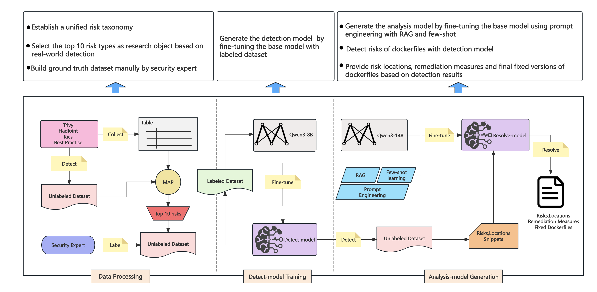
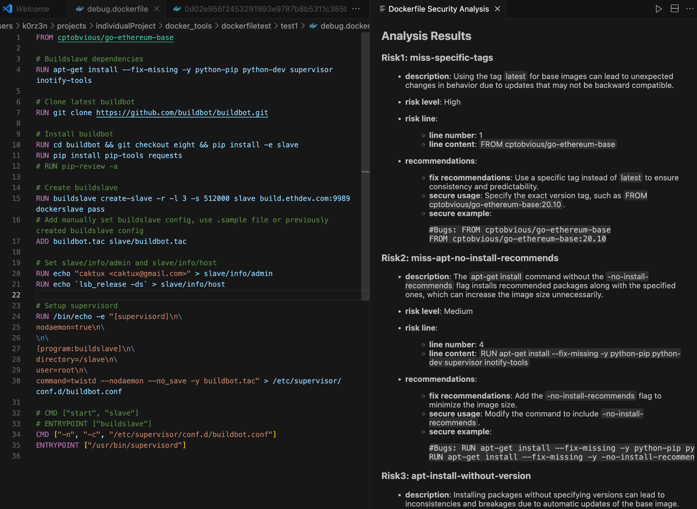

# DockerSec Detection Plugin

DockerSec is a VS Code extension that enables one-click Dockerfile security risk detection and provides detailed explanations of the risk principles and corresponding remediation suggestions.
It’s designed to help developers efficiently address real-world security issues, enhance security awareness, and achieve true “security shift-left” in the development lifecycle.


## Architecture




## Code Overview

- plugin_server — Backend services for detection and analysis used by the plugin.

- plugin_src — Source code of the dockersec_plugin

- dockersec-0.0.1.vsix — Packaged VSIX file of the plugin ready for installation.


## Usage guide

### Plugin Servers Configuration

You need to prepare your own GPU-powered cloud server, configure the LLM inference environment, and bind a domain name to it.

Then, place the model weights required by the detect_server component at the following path on the server: data/checkpoints/final_adapter_8B_v3


```

cd plugin_server/detect_server

uvicorn server:app --host 0.0.0.0 --port 6006

```


```

cd plugin_server/analysis_server

python3 ingest.py

uvicorn app:app --host 0.0.0.0 --port 8008

```

### Plugin Parameter Configuration

open plugin_src/src/extension.ts

1.	Replace [Detector_Domain] in the source code with the domain name of the detect_server in your Plugin_server.

2.	Replace [Analyser_Domain] in the source code with the domain name of the analysis_server in your Plugin_server.

### Plugin Packaging and Installation

```
cd dockersec

vsce package

code --install-extension dockersec-0.0.1.vsix

```

### Plugin Usage

Right-click on a Dockerfile, then select: [Check Dockerfile Security]




**Enjoy!**
